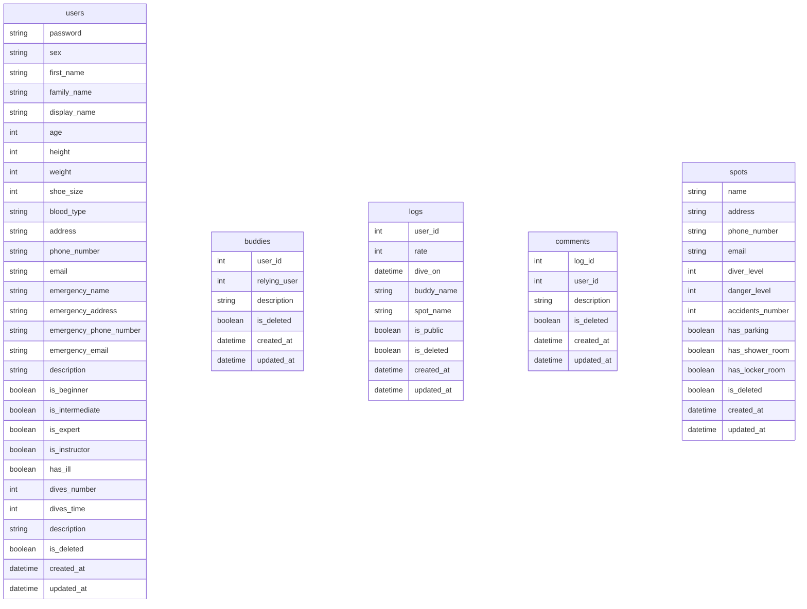

```mermaid

erDiagram
  users {
    string password
    string sex
    string first_name
    string family_name
    string display_name
    int age
    int height
    int weight
    int shoe_size
    string blood_type
    string address
    string phone_number
    string email
    string emergency_name
    string emergency_address
    string emergency_phone_number
    string emergency_email
    string description
    boolean is_beginner
    boolean is_intermediate
    boolean is_expert
    boolean is_instructor
    boolean has_ill
    int dives_number
    int dives_time
    string description
    boolean is_deleted
    datetime created_at
    datetime updated_at
  }

  buddies {
    int user_id
    int relying_user
    string description
    boolean is_deleted
    datetime created_at
    datetime updated_at
  }

  logs {
    int user_id
    int rate
    datetime dive_on
    string buddy_name
    string spot_name
    boolean is_public
    boolean is_deleted
    datetime created_at
    datetime updated_at
  }

  comments {
    int log_id
    int user_id
    string description
    boolean is_deleted
    datetime created_at
    datetime updated_at
  }

  
  spots {
    string name
    string address
    string phone_number
    string email
    int diver_level
    int danger_level
    int accidents_number
    boolean has_parking
    boolean has_shower_room
    boolean has_locker_room
    boolean is_deleted
    datetime created_at
    datetime updated_at
  }

```
